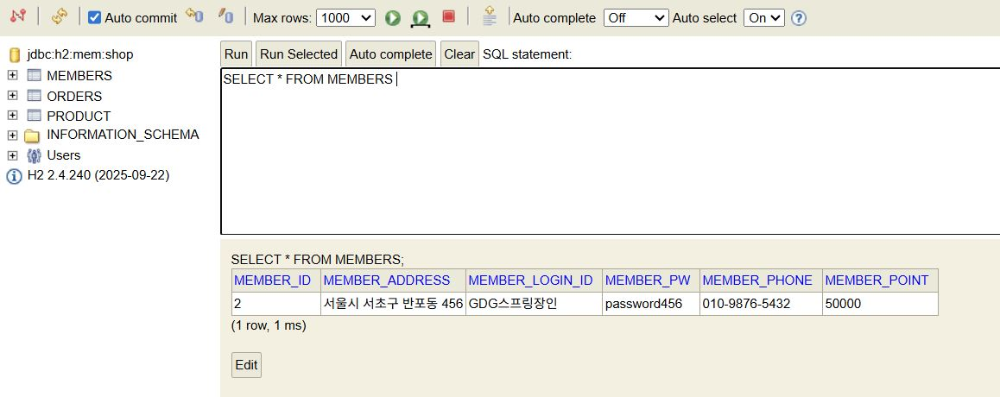
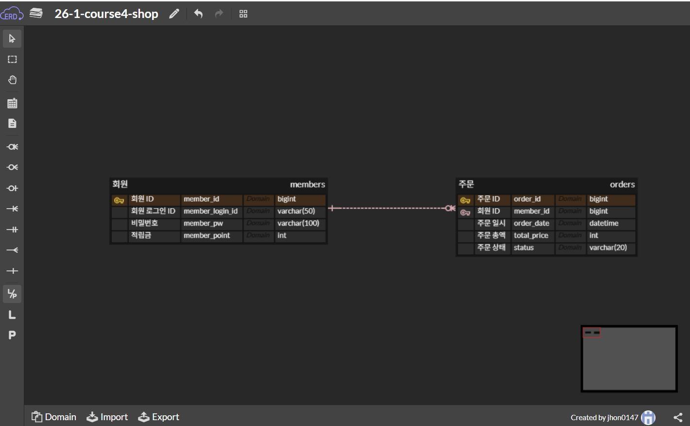
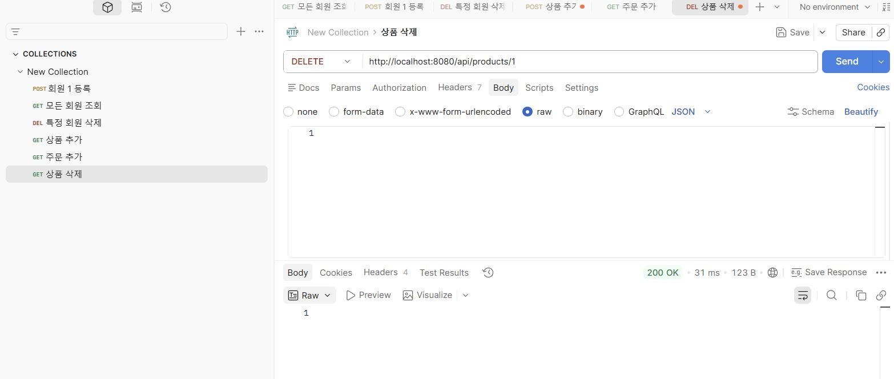
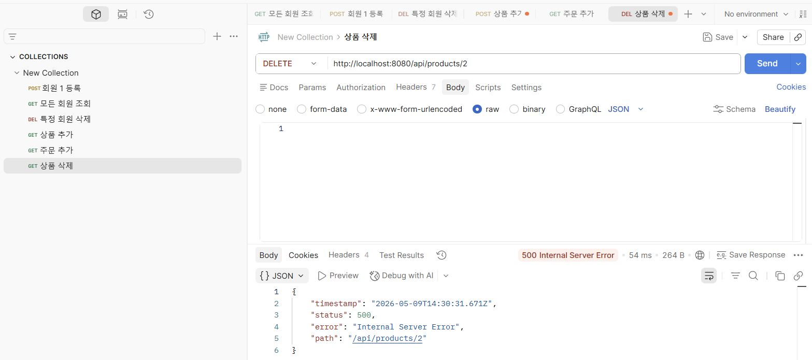

4주차 학습내용
ERD(Entity-Relationship Diagram)
Entity(개체): 데이터를 가진 대상
ex. 회원, 상품, 주문 내역은 어떤 속성, 데이터를 가지고 있는지

Relation(관계): 개체 사이의 연관성
ex. 어떤 회원이 어떤 상품을 주문했는지

개체-관계 중심의 모델링 기법: ER Model (Entity-Relationship Model)

엔티티(Entity): 관리해야 할 데이터의 주체
ex. 회원(Member), 상품(Product), 주문(Order)

속성(Attribute): 각 엔티티가 가지는 구체적 정보
속성 = 필드(Field) = 칼럼(Column)

기본키=고유하게 식별하는 데 사용되는 하나 이상의 컬럼(필드)
외래키=다른 테이블의 PK를 참조(저장)하는 속성(컬럼

4주차 숙제
1.DB ERD 스크린샷

2.스프링 애플리케이션 실행 후 생성된 H2 테이블 스크린샷

3.Member 엔티티를 제외한 도메인 Product, Order CRUD API 중 택 1:
성공 케이스(1장) + 실패 케이스(1장) postman 테스트 결과 스크린샷 첨부

