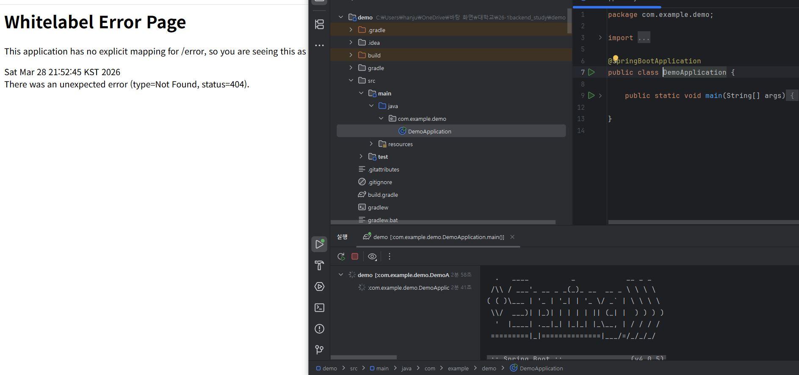

1.1주차 학습내용
웹의 동작 방식(http)->url사용(scheme(protocol), host, port, path, query로 구성됨).
http의 주요 메서드에는 GET, POST, PUT, PATCH, DELETE 등이 있음.

API의 개념과 작성방법->REST API
REST 구성요소
자원-URI
행위-Method
표현-보통 json 형식 사용

2.spring boot 스샷

3.온라인 쇼핑몰 프로젝트 API 명세서
-상품 기능
상품 정보 등록
HTTP Method : POST
URI : /goods
상품 목록 조회
HTTP Method : GET
URI : /goods

개별 상품 정보 상세 조회
HTTP Method : GET
URI : /goods/{goodsId}

상품 정보 수정
HTTP Method : PATCH
URI : /goods//{goodsId}

상품 삭제
HTTP Method : DELETE
URI : /goods//{goodsId}

-------------------------------
-주문 기능
주문 정보 생성
HTTP Method : POST
URI : /order

주문 목록 조회
HTTP Method : GET
URI : /order

개별 주문 정보 상세 조회
HTTP Method : GET
URI : /order/{orderId}

주문 취소
HTTP Method : DELETE
URI : /order/{orderId}
